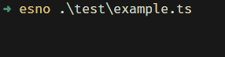

# CLI Stepper

[![npm version][npm-version-badge]][npm-version-href]
[![minzip][minzip-badge]][minzip-href]
[![jsdocs][jsdocs-badge]][jsdocs-href]
[![license][license-badge]][license-href]

A simple CLI stepper for command-line or terminal applications.



## Installation

```bash
npm install cli-stepper
```

## Usage

### Basic Usage

```typescript
import { Stepper } from 'cli-stepper'

const stepper = new Stepper({
  // optional configurations
})

// Start a task
stepper.start('Downloading dependencies')
// As same as:
// stepper.pending('Downloading dependencies')

// Task succeeded.
stepper.success('Dependencies downloaded')

// Task failed
stepper.error('Download failed')
```

> [!IMPORTANT]
> Whenever you want to start the next step, you must end the current step by `.success()` or `.error()`.

### Configuration

The following is the default configuration of the `Stepper` class.

```typescript
const stepper = new Stepper({
  // Badge that will be displayed before the text in different status
  pendingBadge: 'PENDING',
  successBadge: 'SUCCESS',
  errorBadge: ' ERROR ',

  // Color of the badge and text in different status
  pendingColor: 'yellow',
  successColor: 'green',
  errorColor: 'red',

  // Whether to display the spinner animation
  enableSpinner: true,
  // Spinner animation frames, it will be displayed in a loop
  spinnerFrames: ['-', '\\', '|', '/'],
  // Spinner frame interval(ms)
  spinnerInterval: 500,

  // Whether to exit the process gracefully when the task is unexpectly interrupted
  gracefulExit: false,
  // Whether to hide the terminal cursor when the task is pending
  hideCursor: true,
})
```

## License

[MIT](./LICENSE)

<!-- Badge -->
[npm-version-badge]: https://img.shields.io/npm/v/cli-stepper?style=flat&color=ddd&labelColor=444
[npm-version-href]: https://www.npmjs.com/package/cli-stepper
[minzip-badge]: https://img.shields.io/bundlephobia/minzip/cli-stepper?style=flat&color=ddd&labelColor=444&label=minizip
[minzip-href]: https://bundlephobia.com/result?p=cli-stepper
[jsdocs-badge]: https://img.shields.io/badge/jsDocs-reference-ddd?style=flat&color=ddd&labelColor=444
[jsdocs-href]: https://www.jsdocs.io/package/cli-stepper
[license-badge]: https://img.shields.io/github/license/Lu-Jiejie/cli-stepper?style=flat&color=ddd&labelColor=444
[license-href]: https://github.com/Lu-Jiejie/cli-stepper/blob/main/LICENSE
